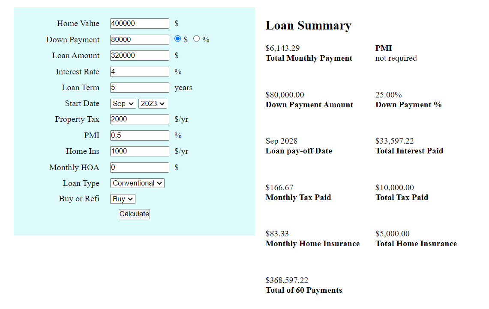
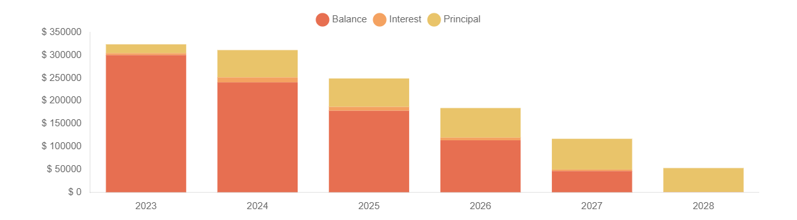

# Mortgage Loan Calculator

This application is a Mortgage Calculator for your site viewers that gives them an idea of what their monthly breakdown of payment will look like. It includes output of an Amortization schedule along with estimated costs for other items involved in a loan payment (PMI, Taxes etc.). The application comes with optional configurable elements, for example you can choose whether or not to let your customers recieve an email with a pdf of the mortgage information (along with a bcc copy to you if you want). The Calculator is meant to be simple for site visitors and configurable for you. You can also choose to set whether the amortization schedule and loan information appears in a div, a modal, or a popup for the results.

---

  - Usable on all PHP 5.2+ sites.
  - Choice of results displayed in a div, modal, or a popup window.
  - No database setup required.
  - Attractive calculator.

### Calculator

### Graph
